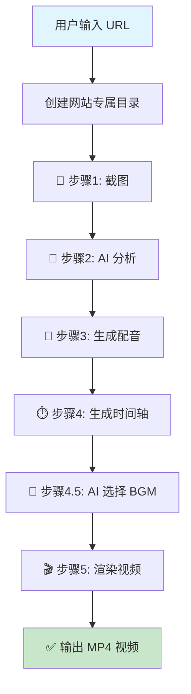
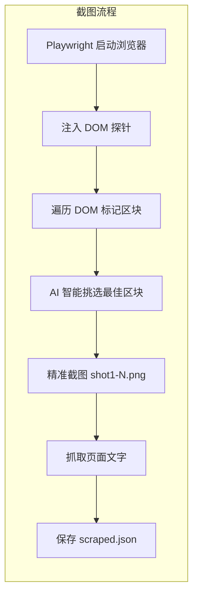
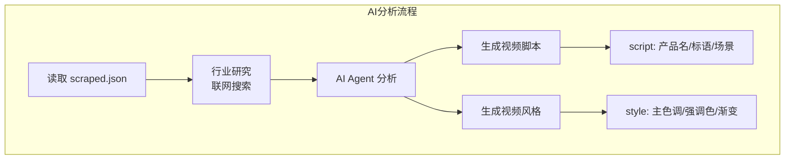
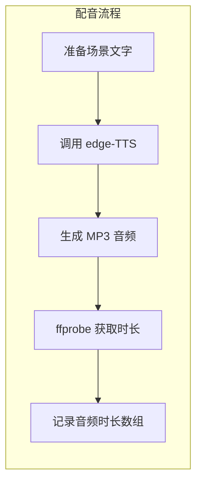
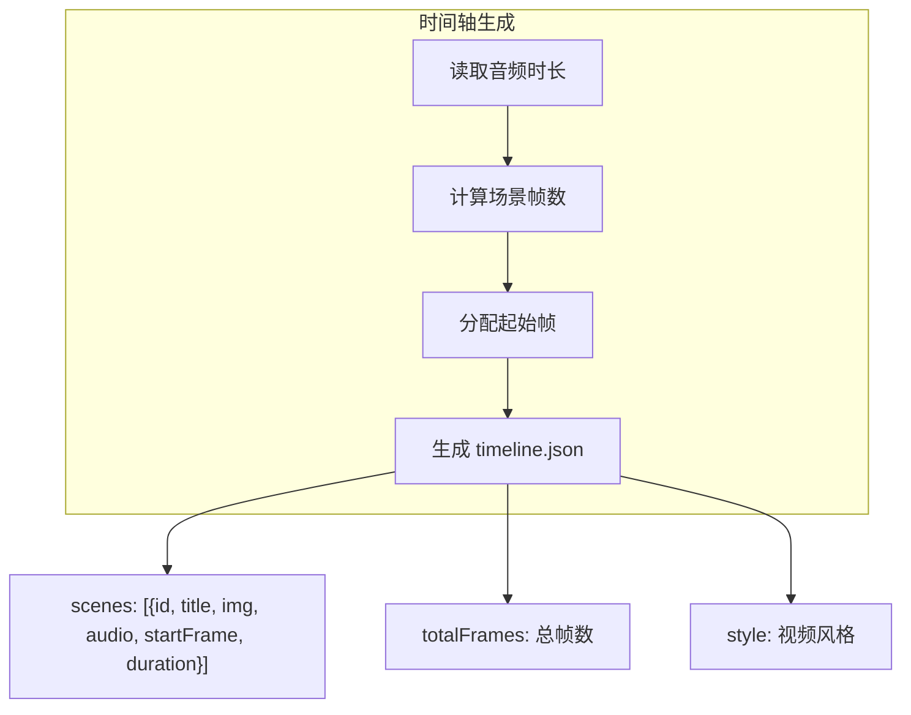
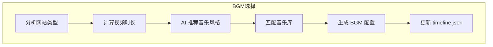
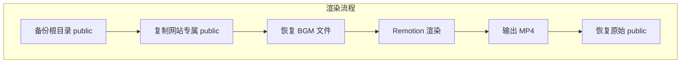

# 介绍视频生成详细流程

> 本文档详细说明 ClickCast 如何从 URL 自动生成带配音、配乐的营销视频

## 整体流程概览

```
URL → DOM注入探针 → AI挑选区块 → 精准截图 → AI分析 → 生成文案 → TTS配音 → Remotion渲染 → MP4视频
```

---

## 流程图

### 主流程



---

## 详细步骤说明

### 步骤 1: 截图 (capture.js)



**详细说明：**

| 阶段 | 操作 | 输出 |
|------|------|------|
| 浏览器启动 | Playwright 无头浏览器访问 URL | - |
| DOM 注入 | 为大容器打上 `data-ai-id` 编号 | - |
| AI 智能挑选 | AI 根据页面内容决定截图数量 (3-8 张) | 区块列表 |
| 精准截图 | `element.screenshot()` 完美贴合边缘 | `shot1.png` ~ `shotN.png` |
| 内容抓取 | 提取页面标题、描述、核心文字 | `scraped.json` |

> **智能截图策略**：AI 会分析页面内容丰富程度，智能决定截图数量。内容丰富时可截取 8 张，内容较少时 3-4 张，确保每张截图都有语义价值。

---

### 步骤 2: AI 分析 (ai-agent.js + industry-research.js)



**输出数据结构：**

```json
{
  "script": {
    "product": "产品名称",
    "tagline": "产品标语",
    "scenes": [
      { "title": "场景标题", "subText": "副标题", "screenshot": "shot1.png" }
    ]
  },
  "style": {
    "primary": "#3B82F6",
    "accent": "#10B981",
    "gradient": ["#1E3A8A", "#3B82F6"]
  }
}
```

---

### 步骤 3: 生成配音 (generate-audio.js)



**配音场景：**

| 场景 | 音频文件 | 内容 |
|------|----------|------|
| Intro | `intro.mp3` | `{产品名}. {场景标题}.` |
| Scene 1-N | `scene1.mp3` ~ `sceneN.mp3` | 场景标题 (与截图数量对应) |
| Outro | `outro.mp3` | `{产品名}. {标语}.` |

---

### 步骤 4: 生成时间轴 (build-timeline.js)



**时间轴计算逻辑：**

```
场景时长(帧) = (音频时长 + 0.5秒缓冲) × 30fps
起始帧 = 上一场景起始帧 + 上一场景时长
```

---

### 步骤 4.5: AI 选择背景音乐 (bgm-selector.js)



**BGM 配置示例：**

```json
{
  "bgm": {
    "file": "bensound-slowlife.mp3",
    "volume": 0.15,
    "fadeInFrames": 30,
    "fadeOutFrames": 60
  }
}
```

---

### 步骤 5: 渲染视频 (Remotion)



**渲染参数：**

| 比例 | 分辨率 | Composition ID | 输出文件 |
|------|--------|----------------|----------|
| 横屏 | 1920×1080 | `ClickCastPromo-Landscape` | `landscape.mp4` |
| 竖屏 | 1080×1920 | `ClickCastPromo-Portrait` | `portrait.mp4` |

---

## 完整数据流图

```mermaid
flowchart TB
    subgraph 输入
        URL[URL]
    end

    subgraph 步骤1-截图
        CAP[capture.js]
        SHOTS[shot1-N.png<br/>(AI决定数量)]
        SCRAPED[scraped.json]
    end

    subgraph 步骤2-AI分析
        IR[industry-research.js]
        AA[ai-agent.js]
        SCRIPT[script.json]
        STYLE[style.json]
    end

    subgraph 步骤3-配音
        TTS[edge-TTS]
        AUDIO[intro.mp3, scene1-N.mp3, outro.mp3]
        DURATION[音频时长数组]
    end

    subgraph 步骤4-时间轴
        BT[build-timeline.js]
        TL[timeline.json]
    end

    subgraph 步骤4.5-BGM
        BGM[bgm-selector.js]
        BGMCONF[bgm 配置]
    end

    subgraph 步骤5-渲染
        REM[Remotion]
        MP4[最终视频 MP4]
    end

    URL --> CAP
    CAP --> SHOTS
    CAP --> SCRAPED

    SCRAPED --> IR
    IR --> AA
    SHOTS --> AA
    AA --> SCRIPT
    AA --> STYLE

    SCRIPT --> TTS
    TTS --> AUDIO
    AUDIO --> DURATION

    SCRIPT --> BT
    DURATION --> BT
    STYLE --> BT
    BT --> TL

    TL --> BGM
    SCRAPED --> BGM
    BGM --> BGMCONF
    BGMCONF --> TL

    TL --> REM
    SHOTS --> REM
    AUDIO --> REM
    REM --> MP4
```

---

## 文件结构

```
websites/{domain}/
├── public/
│   ├── shot1.png          # AI 精选截图 (3-8张)
│   ├── shot2.png
│   ├── shot3.png
│   ├── ...                 # 根据页面内容决定数量
│   ├── scraped.json       # 抓取的页面内容
│   ├── intro.mp3          # 开场配音
│   ├── scene1.mp3         # 场景配音 (与截图数量对应)
│   ├── scene2.mp3
│   ├── ...                 # 每张截图对应一个场景配音
│   ├── outro.mp3          # 结尾配音
│   └── timeline.json      # 视频时间轴
└── out/
    ├── landscape.mp4      # 横屏视频
    └── portrait.mp4       # 竖屏视频
```

---

## 命令行使用

```bash
# 生成横屏视频 (1920x1080)
node pipeline.js "https://stripe.com" landscape

# 生成竖屏视频 (1080x1920)
node pipeline.js "https://stripe.com" portrait

# 预览视频
npm start

# 渲染输出
npm run render-landscape  # 横屏
npm run render-portrait   # 竖屏
```

---

## 关键配置

| 配置项 | 说明 | 默认值 |
|--------|------|--------|
| `DEEPSEEK_API_KEY` | DeepSeek API Key | (必填) |
| `API_BASE_URL` | API 地址 | `https://api.deepseek.com` |
| `AI_MODEL` | AI 模型 | `deepseek-chat` |
| `VOICE` | 配音声音 | `en-US-ChristopherNeural` |
| `BGM_VOLUME` | 背景音乐音量 | `0.15` |
| 截图数量 | AI 智能决定 | 3-8 张 |